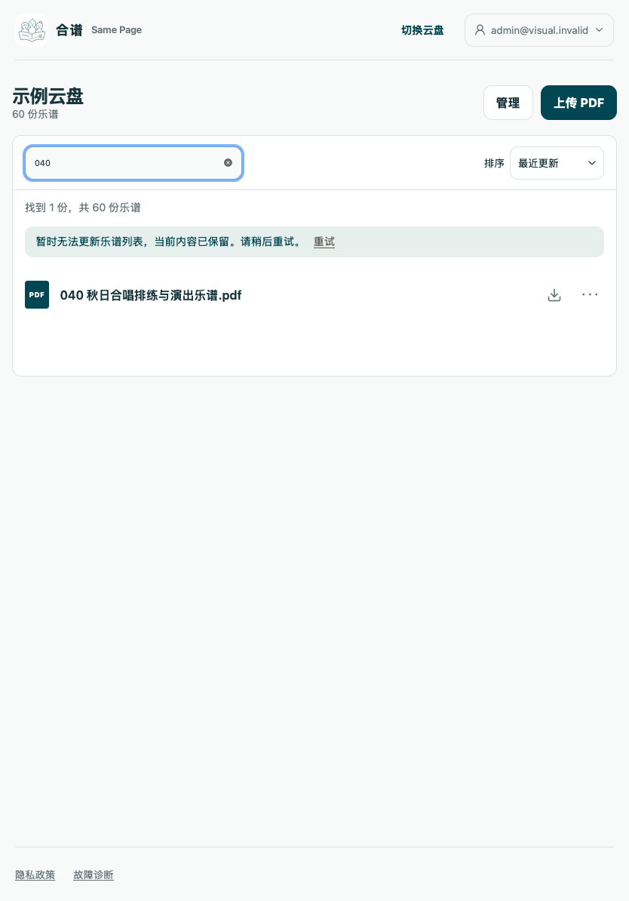
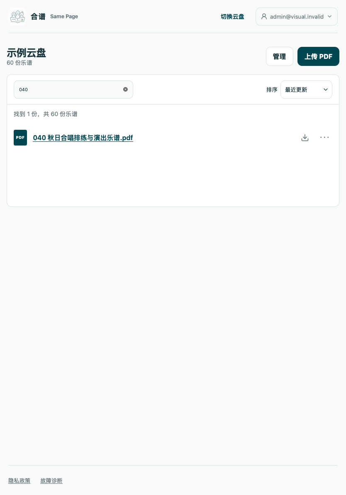
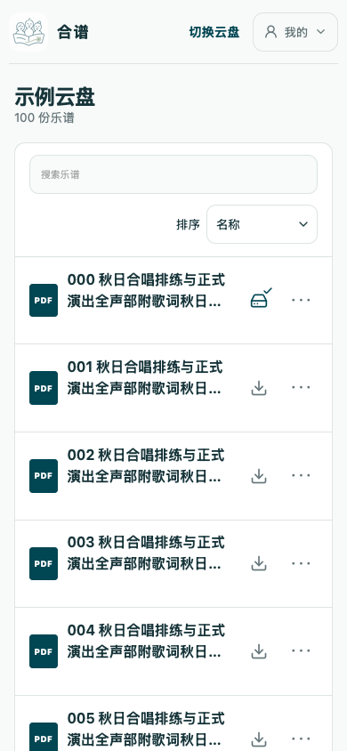
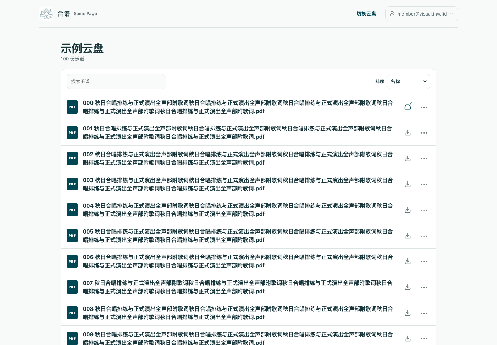

# Issue #150 验证记录

云盘文件库恢复、刷新和返回位置已收拢到同一 module。实现提交 `588ad42`；下列证据来自独立本地 worktree，使用模拟网络和桌面 Chromium/WebKit，不代表生产或真实移动设备验收。

- lint、TypeScript 和生产构建通过。
- 单元测试：18 文件、72 项通过；客户端测试：39 文件、297 项通过。
- Node 24.20.0 下，文件库生命周期、云盘交互和响应式导航：8 项通过，进程退出码 0。
- 双引擎验证缓存返回时关闭管理权限、联网成功恢复权限、背景刷新不跳回旧位置、焦点/联网请求合并、失败时保留列表及重试后搜索排序不变。
- 390、834、1194、1440 宽度检查无横向溢出，保留 44px 操作目标、键盘菜单和原有离线副本交互。
- Standards / Spec 两项独立代码审查均为 0 项发现。

客户端全量测试曾与浏览器并行运行，出现一次已有首页懒加载场景超时；改为两名测试 worker 单独运行后全部通过。初次 Node 25 浏览器运行全部断言通过但退出码非零，已以仓库指定的 Node 24 完整重跑并确认退出码 0。

CI 暴露的返回位置竞争已补充确定性回归：下一路由的布局阶段将滚动归零时，旧文件库的被动清理尚未执行，旧监听会把保存位置覆盖为 0。滚动监听现在在布局阶段清理；请求启动维持被动 effect，保留身份观察器先清理旧缓存的顺序。新增测试覆盖这两项时序；最终实现的 Chromium 4 倍 CPU 降速连续 5 次通过。上传队列浏览器 fixture 同步改用完整 bootstrap 响应，覆盖变更后的刷新契约。

原始摘要见 [evidence.json](evidence.json)。CI 结果以 PR 当前提交为准。

| 刷新失败保留内容 | 重试后保留筛选 |
| --- | --- |
|  |  |

| 390px 文件库 | 1440px 文件库 |
| --- | --- |
|  |  |
