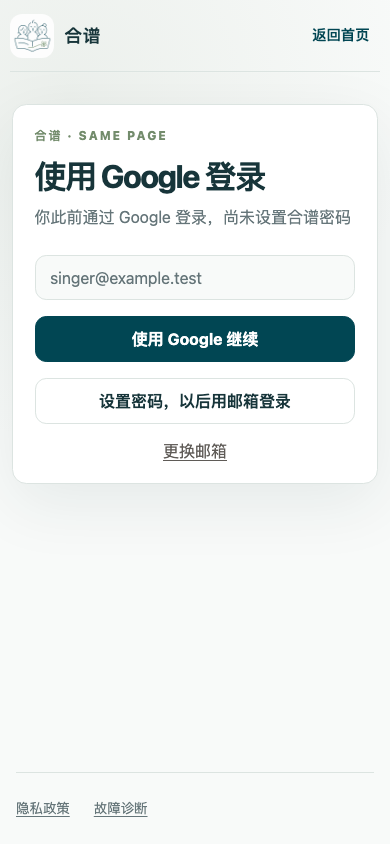
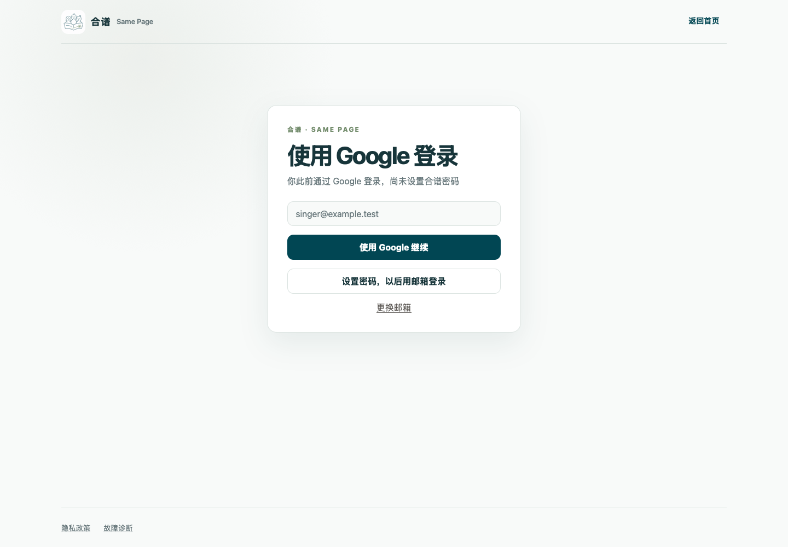
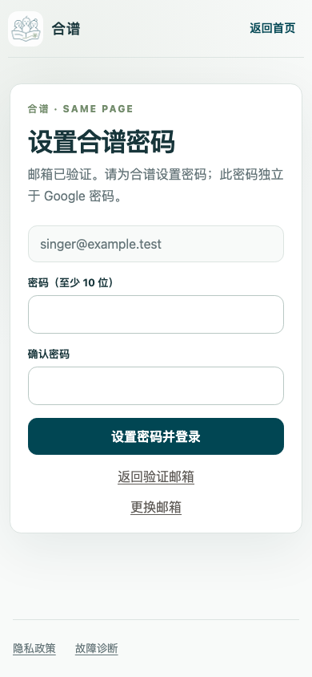
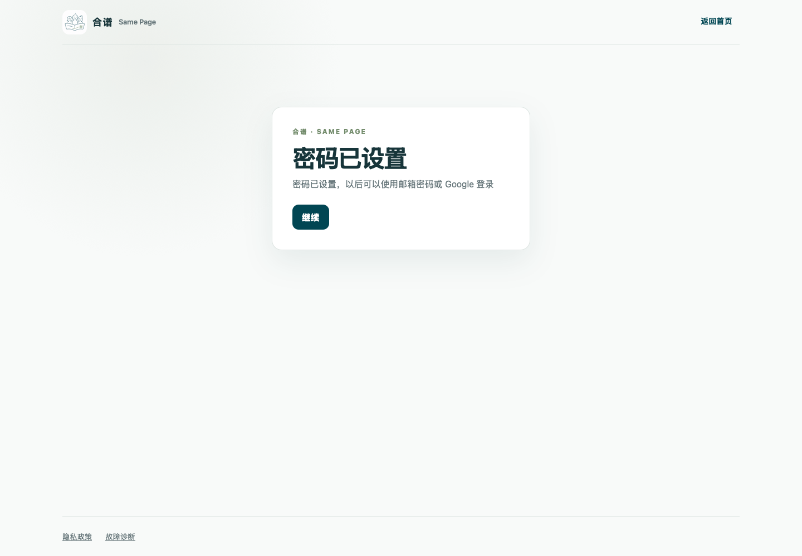

# #138 按已有认证身份引导登录

登录入口保留“输入邮箱 → 继续”。已验证邮箱还需检查是否存在持有密码的 `credential` 认证身份：存在则进入密码登录；不存在则进入首次设置密码。存在 Google 身份时优先显示 Google 登录，且只有提供方已配置时显示按钮。未注册或尚未验证的邮箱沿用注册流程，未验证身份不会因此获得 Google 自动关联资格。

`POST /api/auth/flow` 返回三种状态：`{ flow: "sign-up" }`、`{ flow: "sign-in" }`、`{ flow: "set-password", hasGoogle: boolean }`。分流保持原有限流，并返回 `Cache-Control: no-store`。没有密码的已验证预置用户也能验证邮箱后设置密码，不被误导到重复注册。

首次设置密码使用现有邮箱所有权验证能力：发送 `forget-password` 验证码，调用 `check-verification-otp` 验证后才显示密码表单；提交时由 `reset-password` 再次验证、原子消费验证码，并在原用户下增加密码认证身份。客户端的“已验证”状态不授予修改密码的权限。验证码仍以哈希存储，十分钟有效，允许三次错误尝试，邮件发送沿用邮箱冷却及邮箱/客户端限流；密码策略仍是 10–128 位。沿用密码重设邮件模板及会话撤销行为。

成功后自动执行邮箱密码登录，显示“密码已设置，以后可以使用邮箱密码或 Google 登录”，用户按“继续”进入既有登录后流程（首页、公开体验、邀请云盘或用户恢复）。响应丢失时先尝试用所选密码登录，避免直接重放已消费的验证码；自动登录失败时转到密码登录并说明恢复方式。返回、重新验证、更换邮箱都提供明确入口。

## 验证

- Worker 集成测试使用真实 Worker、D1、Better Auth 和本地签名的模拟 Google OAuth 回调；只模拟 Google 与邮件外部服务。覆盖三种状态、邮箱注册后 Google 关联、未验证本地身份拒绝关联、Google 后首次设置密码、两种方式返回同一用户 ID、成员关系及个人批注读回不变、密码策略、验证码错误/过期/耗尽/一次性消费和发送冷却。
- 客户端测试覆盖分流文案、提供方未配置时隐藏入口、先验证后显示密码、返回及更换邮箱、网络失败、冷却恢复、失效验证码、设置响应丢失、自动登录失败及成功后继续。
- 浏览器测试使用 Chromium 手机尺寸 390×844 和 WebKit 桌面尺寸 1440×1000，操作错误验证码及重试、返回验证、设置密码、成功后继续、已有密码页的 Google 入口；检查各屏没有横向溢出。此处 API 使用本地响应夹具。

截图由 `node --test visual-report/auth-methods.test.mjs` 生成于 `artifacts/verification/auth-138/`。下列选图随 PR 保存，使用虚构邮箱；未展示输入的密码或验证码。

| 手机登录方式 | 桌面登录方式 |
| --- | --- |
|  |  |

| 手机设置密码 | 桌面设置完成 |
| --- | --- |
|  |  |

这些证据是本地集成与浏览器模拟验收，未执行真实 Google 登录、真实收件箱投递或手机实体设备验收。本 PR 不部署生产；发布后仍需以真实 Google 用户检查两种登录方式及原有数据。
