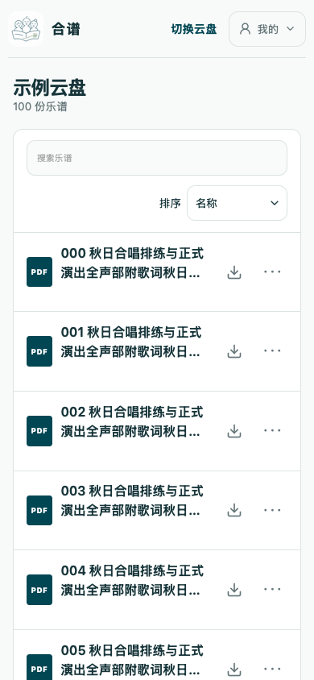
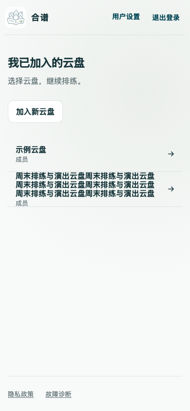

# #140 云盘入口与乐谱库验证

对应 [#140](https://github.com/itscly2026/same-page/issues/140)。基于 main `6de4882` 独立实现；不包含 #138 的认证方式改动，也不涉及 #111、#99、阅读页码跟踪或生产部署。

## 行为边界

- 默认首页只读取当前已确认用户的 `/api/choirs` 成员关系。一个成员云盘用 `replace` 进入，多个保留选择列表，零个显示邀请码加入说明。默认登录完成也使用替换历史，返回不会再次进入登录或自动分流循环。
- 自动分流只在无查询参数的默认首页、且未主动打开加入弹窗时启用。`/?join=1`、云盘/乐谱深链接、认证中的体验及邀请续接、云盘内主动切换不经过该分流。公开体验配置不加入计数；若用户本就持有该云盘的真实成员关系，仍按成员关系计入。
- 身份未确认时不显示成员列表；身份变化重建首页状态，成员请求有用户标记与取消保护。失败显示重试，并可打开同一活跃本机 owner 保存的文件；这些恢复链接不表示成员授权或已校验可离线，阅读器仍执行原有完整校验。
- 文件名保持乐谱的主要名称。列表名称最多两行，完整名称通过原有链接可访问名称、悬停提示和“更多操作 → 文件信息”可达。所有读者都能查看文件大小、页数、PDF 版本；管理动作仍仅管理员可见。
- 搜索可访问名称和占位文案均为“搜索乐谱”，仍匹配文件名。保留名称、最近更新、本机最近打开排序及从阅读器返回后的搜索/排序恢复，不增加阅读页码展示。
- 每行只有一个离线状态与操作入口。下载和校验期间显示进行中状态，失败可重试；只在已验证的当前版本及当前谱面显示方式有副本时显示就绪标记。

## 自动化与交互证据

- `home-entry.test.tsx` 覆盖零/一/多成员、缓存体验摘要不参与计数、替换历史、邀请码弹窗、主动切换、显式云盘链接、失败重试、未确认身份、已加载旧用户列表隔离、迟到旧响应及邮箱登录到单云盘。
- 现有 `app.test.tsx`、`auth-page.test.tsx` 保留公开体验直接访问、邀请认证续接和阅读器深链接覆盖；补充非管理员文件信息及搜索文案验证。
- `saved-score-links.test.tsx` 验证本机恢复链接的 owner 隔离；`offline-score-control.test.tsx` 验证下载中、不提前声称可离线、校验后就绪、失败重试、旧版/损坏副本，以及谱面显示方式不匹配。
- `visual-report/drive-entry-library.test.mjs` 在 Chromium、WebKit 的持久浏览器档案中，实际执行默认入口 → 搜索/排序 → 键盘打开文件信息 → 注入下载失败 → 重试成功 → 打开渲染 PDF → 返回保留搜索/排序 → 清除无结果搜索。另检查 100 个超长文件名、空库、零/多成员和 390×844、834×1194、1194×834、1440×1000 视口的无溢出与至少 44px 操作目标。
- [Chromium 交互记录](evidence-140/chromium-interactions.json) / [WebKit 交互记录](evidence-140/webkit-interactions.json)。记录使用合成成员和乐谱数据；下载字节、SHA-256 校验、IndexedDB 和 PDF 渲染在真实浏览器引擎中执行。新增交互测试仅模拟已安装应用壳的检查，不以此证明断网冷启动；独立 `test:pwa-update` 承担应用壳及更新切换验证。

这些是 macOS 上的自动浏览器及模拟视口证据，不是真实 iPhone/iPad Safari、Pencil 或弱网设备验收。WebKit 临时隐私档案无法可靠保存 PDF Blob，改用独立持久档案后验证通过。没有操作生产数据。

## 截图

手机长文件列表与多云盘选择：

[iPad 竖屏尺寸](evidence-140/webkit-long-library-834.png) · [iPad 横屏尺寸](evidence-140/webkit-long-library-1194.png) · [桌面尺寸](evidence-140/webkit-long-library-1440.png)

[零成员](evidence-140/webkit-zero-drives.png) · [无上传权限的空库](evidence-140/webkit-empty-library.png) · [文件信息](evidence-140/chromium-file-info.png)

[下载失败与重试](evidence-140/webkit-offline-failed.png) · [校验后可离线](evidence-140/webkit-offline-ready.png)

## 代码审查

按 code-review 技能以 `6de4882` 为固定点，由独立子代理审查实现提交 `10d4837`，并追加复核 `a5a5baa` 的最终视觉调整及证据：Standards 0 项，Spec 0 项。

## 全量检查入口

本地以 `VITEST_MAX_WORKERS=2 npm run check:full` 运行完整检查，降低并发以避免开发机资源竞争造成导航等待超时；Python 使用按 `renderer/requirements.txt` 安装的独立虚拟环境。检查包含原生渲染、PWA 更新、lint/typecheck、全部单元/客户端/Worker 测试、浏览器布局、迁移、生产构建、浏览器 Worker smoke 和加载性能预算。最终结果记录于 [PR #144](https://github.com/itscly2026/same-page/pull/144) 的验证说明及 CI；这份文档不代表已经发布。
