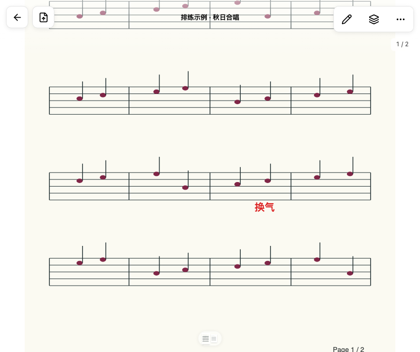
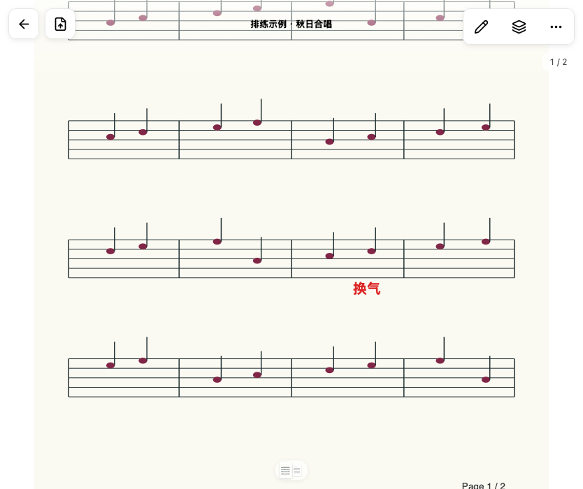
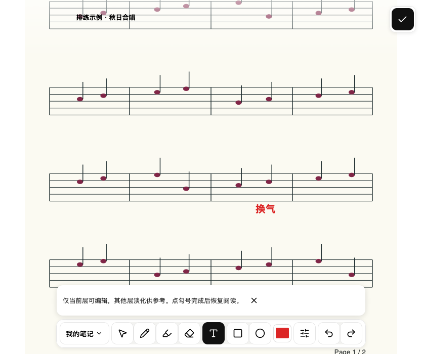

# #300 连续滚动几何提交验证

基线 `bde16c8`，macOS / Node 25.9.0，本地 Chromium 与 WebKit。Node 测试使用 `NODE_OPTIONS=--no-experimental-webstorage`；CI 使用仓库配置的 Node 24。本文不代表合并、生产部署或真实 iPad Safari / Home Screen PWA / Pencil 验收。

## 改动与覆盖

`useContinuousReaderLayout` 拥有 PDF metadata、文档身份、TanStack Virtual、fit / 编辑翻页意图、缩放提交后的定位、程序 scroll 反馈隔离、固定页间距和首尾 padding，以及返回位置恢复。调用者只接入 DOM、渲染页面项和既有几何手势能力。

最小 React harness 使用真实 TanStack Virtual，仅替换 DOM 尺寸/ResizeObserver 和 PDF metadata。8 项测试覆盖：迟到 metadata、文档替换、程序 scroll 与视口中心选页、fit/resize 交错、busy 拒绝不重放、首尾短页、返回恢复、未提交 fit 被新选择替代。保留路由接线、手势和笔记交互测试；路由编辑翻页测试补上 1000×800 尺寸，避免用 JSDOM 的零尺寸作几何证明。

本地验证：

- `npm run test:client -- --maxWorkers=2`：77 文件 / 679 项通过；随后新增的 supersession 测试及当前 hook 文件 8 项通过。
- `npm run test:unit -- --maxWorkers=2`：26 文件 / 117 项通过。首次全量在 `process-lifecycle.test.js` 出现 `kill EPERM`；该文件在基线和分支单独复跑均通过，限制并发后 unit 全量通过，未修改进程管理实现或断言。
- `npm run lint`、`npm run typecheck`、`npm run build`（含 precache 验证）：通过。
- `reader-mobile-editing`：11 项通过，包括两种引擎的编辑翻页/居中和首尾页限制。
- `reader-immersive`：首次分支 12/14；Chromium scroll 1100 场景第一次在测试读取尚未挂载的 page 节点时失败，定点复跑通过。WebKit scroll 300 场景有下述基线失败。
- 新增 `continuous-reader-layout.test.mjs`：Chromium / WebKit 2/2 通过，验证初始适合宽度、进入/退出编辑保留位置、经阅读偏好路由返回保留位置及显式适合页面。相同测试跑在基线时 WebKit 返回位置为 0，而期望为 300；新实现等待真实几何后才恢复，harness 另覆盖 metadata 延迟。
- code-review 两轴审查后的重复尺寸 hook、待提交 fit supersession 覆盖意见均已解决。

## 已知基线失败

`node --test --test-name-pattern='continuous pinch' visual-report/reader-immersive.test.mjs`：3/4 通过。WebKit scroll 300 的谱面锚点保持不变，但文字的边界框改变。基线与分支逐项数值相同：

- 谱面点 preview `(300, 300)` → after `(300, 300.0086863363929)`。
- 文字 preview `x=98, width=872.15625` → after `x=103, width=861.859375`。

这不是本次 diff 引入的几何差异。保留原断言，没有放宽阈值或重试隐藏失败；本 PR 不宣称该 WebKit 测试已通过。

## 同条件前后截图

`continuous-reader-layout.test.mjs` 使用同一 member fixture、834×700 viewport、light、zh-CN、reduced motion，连续阅读 `zoom=1, scrollTop=300`。四组前后 PNG 的 SHA-256 均完全相同，阅读位置、留白及编辑覆盖没有像素差异。截图原始输出保存在 `artifacts/verification/continuous-layout/{before,after}`。

| 场景 | 前 | 后 |
| --- | --- | --- |
| Chromium 阅读 |  |  |
| Chromium 编辑 |  |  |
| WebKit 阅读 |  |  |
| WebKit 编辑 |  |  |
