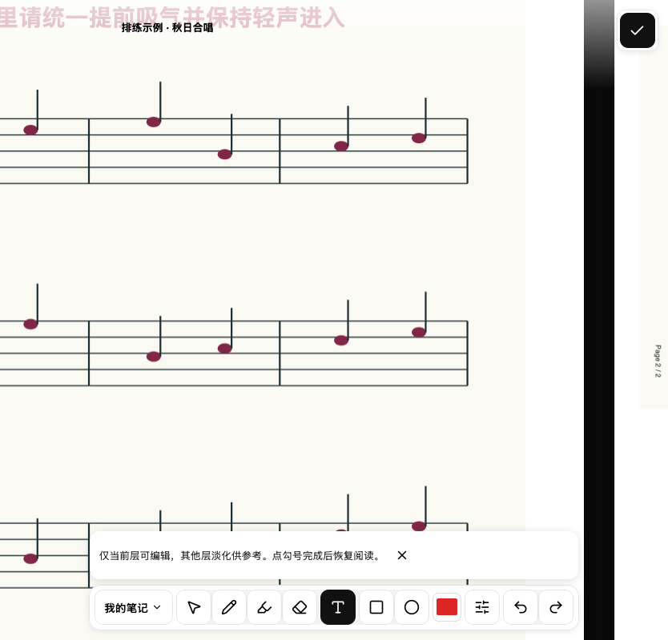
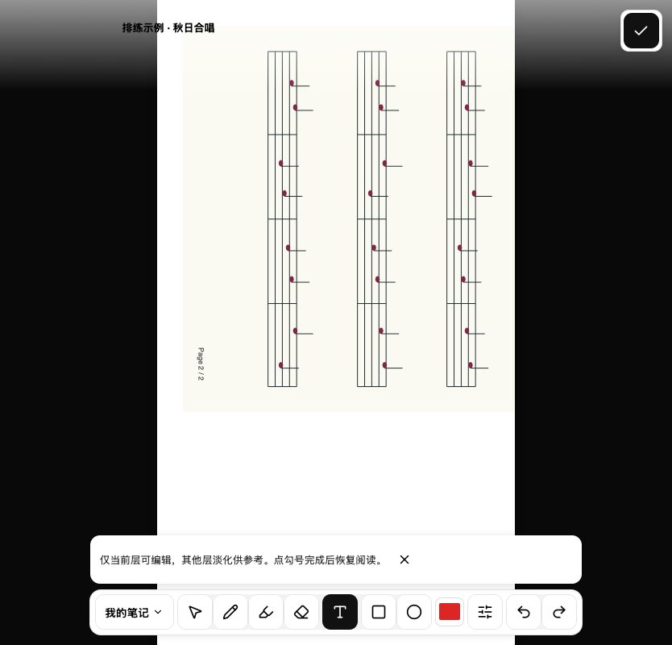
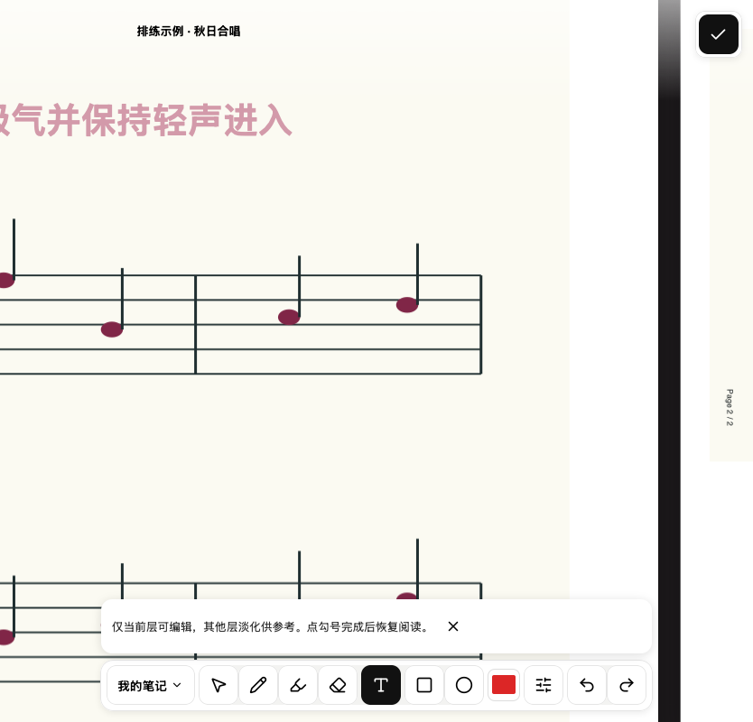
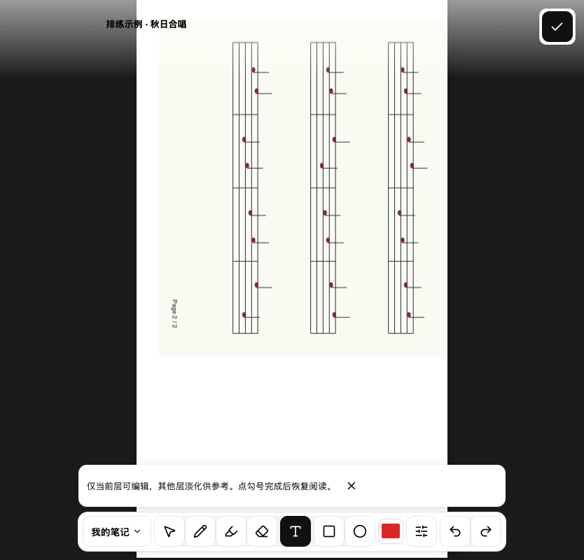

# #302 统一横向翻页验证

2026-09-13，macOS 本地 worktree，Node 24.21.0。测试覆盖阅读／编辑、适应页面／放大、翻页／连续布局；横向完成规则只由 `usePagedReader` 决定。数据库、API、IndexedDB 与已保存笔记格式均未改变。

## 自动化结果

- Node 单元测试：26 个文件、117 项通过。
- 完整客户端测试：`vitest run --config vitest.client.config.ts --maxWorkers=1`，79 个文件、707 项通过。首次并发完整运行有 9 项失败；其中 3 项是本次替换的旧翻页／测试几何合同，其余 6 项隔离重跑通过。没有扩大超时或添加重试。
- `npm run build`（含 typecheck 与 precache 校验）、ESLint 通过。
- 既有 Chromium/WebKit 浏览器回归 17 项通过：`continuous-reader-layout`、`reader-mobile-editing`、`reader-canvas-layering`、`reader-text-layout`。
- 新增 `reader-navigation.test.mjs`：Chromium、WebKit 各 8 组组合通过，另有 1 项 Chromium 原生触摸测试通过。第二页使用不同尺寸并旋转 90°，检查跟手、取消后缩放、成功后目标比例与居中、编辑工具保留。
- 原生 Chromium 输入协议验证纵向 `touchmove` 不被取消、释放后仍有惯性，横向由共享导航消费。WebKit 桌面不支持构造 `Touch`；其连续模式测试发送完整触点快照检查真实 DOM 上的 TouchEvent 监听路径，不作为原生 iPad 惯性证明。
- 手势／pager／编辑器回归涵盖反向收回进度、平移不计入速度、同帧双指识别、替换触点清理、平移转捏合不重复位移、文档切换取消旧准入、保存失败与对象归属。

运行浏览器测试：`node --test --test-concurrency=1 visual-report/reader-navigation.test.mjs`。也可用 `NAVIGATION_CASE=page-read-2` 单独定位组合；`LAYOUT_TEST_ORIGIN` 可复用已经启动的本地 Vite 测试服务器。CI 保存 `artifacts/verification/` 中的截图。

## 审查与预览

已执行 code-review 的 Standards／Spec 双轴审查。Standards 无硬性问题，重复呈现调用已合并；Spec 找到的触点替换残留预览、平移转捏合重复位移均已修正，新增回归通过并经复核。

本地交互预览使用 fixture 云盘／谱面，不连接生产数据；本次会话地址为 `http://127.0.0.1:49403/choirs/visual-choir/scores/visual-score`，只在本机进程存活时可访问。以下为 WebKit 桌面真实布局截图，目标页特意旋转以检查不同几何。

| 布局 | 拖动中 | 完成后 |
| --- | --- | --- |
| 翻页 |  |  |
| 连续 |  |  |

## 尚待真机验收

未执行 iPad Safari／安装后 PWA 真机验收，不能用桌面 WebKit、模拟触摸或截图替代。验收时记录设备型号、iPadOS 版本、Safari／主屏幕启动方式；重点检查单／双指交接、连续纵向惯性、捏合触点增减、Pencil 对象归属和翻页跟手。提交 PR 不代表已合并或部署。

## PR #307 CI 失败复核与修复

2026-09-13，分支已 rebase 到 main `53ea4c1`。前两次 CI 的 Linux WebKit 在 `page-read-2` 找不到 dragging；增加只读失败现场后，另一次失败暴露在 `continuous-read-2`，进度被逆转成正值。没有增加断言超时、删除场景或添加重试。

在独立 Linux/Ubuntu 22.04、Node 24.19.0、同版 Playwright 环境复现。临时事件采样确认：测试的合成触摸 `pointerId=1` 与初始 locator.click 使用的真实鼠标 `pointerId=1` 冲突。WebKit 在滚动/布局变化后发送鼠标移动，导致已发送的 `remaining=-100` 被鼠标坐标 `(417,400)` 改写成 `remaining=0`，导航退回 idle。该单场景在修复前连续复现两次。临时采样已从产品代码移除，仅保留测试失败时的只读几何快照。

- 浏览器测试的合成 PointerEvent 与 TouchEvent 都使用独立编号 `101+index`，避免与真实鼠标混用；全部原断言保留。只改测试编号、产品手势代码保持原样时，Linux WebKit 8 个组合已全部通过。
- 同时发现真实边界缺陷：连续模式将 TouchEvent.identifier 与 PointerEvent.pointerId 用作同一数字键。内部改为包含事件来源的 contactKey，未追踪的 up/cancel 不影响其他触点。三个同号鼠标 move/up/cancel 回归在修复前全部失败，修复后通过，并验证触摸仍可继续及正常结束。
- Spec 复核还发现缩略图选择直接修改页码。已改用 goToPage；回归验证目标未 ready 时仍保留当前页，ready 后经公共过渡提交。原立即跳页断言先改为等待公共过渡并确认失败，再修复。
- Standards：0 项硬性违规；重复平移余量读取已抽取，并限定当前页。Spec：上述遗漏已修复，最终复核无剩余发现。

最终本地验证：Node 117 项、客户端 713 项（79 文件）通过；typecheck、lint、build 通过。macOS Chromium/WebKit 共 16 个导航组合和 Chromium 原生触摸测试通过；Linux WebKit 8 个组合通过。Linux 复现命令：`SAME_PAGE_BUILD_ID=<tested-head> NAVIGATION_CASE=page-read-2 node --test --test-name-pattern='^webkit:' visual-report/reader-navigation.test.mjs`；去掉 NAVIGATION_CASE 运行全部 8 个组合。Linux 证据仍不代表 iPad 真机验收。
